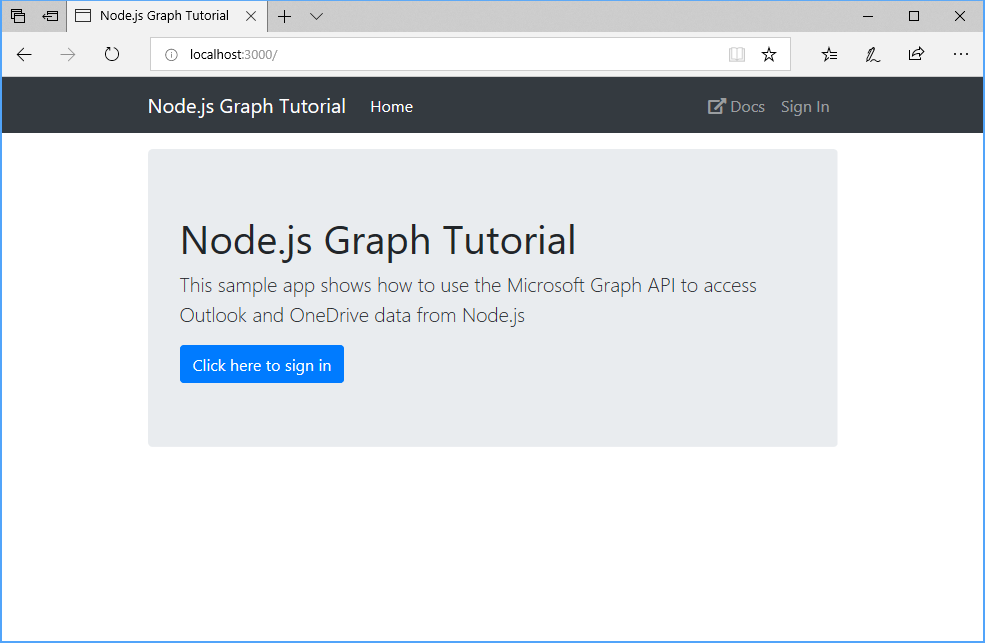

<!-- markdownlint-disable MD002 MD041 -->

En este ejercicio, usará [Express](http://expressjs.com/) para crear una aplicación Web.

1. Abra la CLI, vaya a un directorio donde tenga derechos para crear archivos y ejecute el siguiente comando para crear una nueva aplicación Express que use [manillares](http://handlebarsjs.com/) como motor de representación.

    ```Shell
    npx express-generator@4.16.1 --hbs graph-tutorial
    ```

    El generador de Express crea un nuevo directorio `graph-tutorial` al que se llama y scaffolding una aplicación Express.

1. Desplácese hasta `graph-tutorial` el directorio y escriba el siguiente comando para instalar las dependencias.

    ```Shell
    npm install
    ```

1. Ejecute el siguiente comando para actualizar los paquetes de nodos con vulnerabilidades de las que se ha informado.

    ```Shell
    npm audit fix
    ```

1. Use el siguiente comando para iniciar un servidor Web local.

    ```Shell
    npm start
    ```

1. Abra el explorador y vaya a `http://localhost:3000`. Si todo funciona, verá un mensaje "Bienvenido a exprés". Si no ve ese mensaje, consulte la [Guía de introducción rápida](http://expressjs.com/starter/generator.html).

## <a name="install-node-packages"></a>Instalación de paquetes de nodos

Antes de continuar, instale algunos paquetes adicionales que usará más adelante:

- [dotenv](https://github.com/motdotla/dotenv) para cargar los valores de un archivo. env.
- [momento](https://github.com/moment/moment/) para dar formato a valores de fecha y hora.
- mensajes de error de [Connect-Flash](https://github.com/jaredhanson/connect-flash) a Flash en la aplicación.
- [Express-Session](https://github.com/expressjs/session) para almacenar valores en una sesión del lado servidor de la memoria.
- [Passport-Azure-ad](https://github.com/AzureAD/passport-azure-ad) para autenticar y obtener tokens de acceso.
- [simple: OAuth2 para la](https://github.com/lelylan/simple-oauth2) administración de tokens.
- [Microsoft-Graph-Client](https://github.com/microsoftgraph/msgraph-sdk-javascript) para realizar llamadas a Microsoft Graph.
- [isomórfico: fetch](https://github.com/matthew-andrews/isomorphic-fetch) para subllenar la búsqueda para el nodo. Se requiere un polyfill de Fetch para la `microsoft-graph-client` biblioteca. Vea la [biblioteca cliente de JavaScript de Microsoft Graph](https://github.com/microsoftgraph/msgraph-sdk-javascript/wiki/Migration-from-1.x.x-to-2.x.x#polyfill-only-when-required) para obtener más información.

1. Ejecute el siguiente comando en su CLI.

    ```Shell
    npm install dotenv@8.2.0 moment@2.24.0 connect-flash@0.1.1 express-session@1.17.0 isomorphic-fetch@2.2.1
    npm install passport-azure-ad@4.2.1 simple-oauth2@3.3.0 @microsoft/microsoft-graph-client@2.0.0
    ```

    > [!TIP]
    > Es posible que los usuarios de Windows reciban el siguiente mensaje de error al intentar instalar estos paquetes en Windows.
    >
    > ```Shell
    > gyp ERR! stack Error: Can't find Python executable "python", you can set the PYTHON env variable.
    > ```
    >
    > Para solucionar el error, ejecute el siguiente comando para instalar las herramientas de compilación de Windows mediante una ventana de terminal con privilegios elevados (Administrador) que instala las herramientas de compilación de VS y Python.
    >
    > ```Shell
    > npm install --global --production windows-build-tools
    > ```

1. Actualice la aplicación para usar el `connect-flash` software `express-session` intermedio y. Abra el `./app.js` archivo y agregue la siguiente `require` instrucción en la parte superior del archivo.

    ```javascript
    var session = require('express-session');
    var flash = require('connect-flash');
    ```

1. Agregue el siguiente código inmediatamente después de `var app = express();` la línea.

    :::code language="javascript" source="../demo/graph-tutorial/app.js" id="SessionSnippet":::

## <a name="design-the-app"></a>Diseñar la aplicación

En esta sección, implementará la interfaz de usuario de la aplicación.

1. Abra el `./views/layout.hbs` archivo y reemplace todo el contenido por el código siguiente.

    :::code language="html" source="../demo/graph-tutorial/views/layout.hbs" id="LayoutSnippet":::

    Este código agrega un [bootstrap](http://getbootstrap.com/) para los estilos sencillos y la [fuente maravilla](https://fontawesome.com/) para algunos iconos simples. También define un diseño global con una barra de navegación.

1. Abra `./public/stylesheets/style.css` y reemplace todo el contenido por lo siguiente.

    :::code language="css" source="../demo/graph-tutorial/public/stylesheets/style.css":::

1. Abra el `./views/index.hbs` archivo y reemplace el contenido por lo siguiente.

    :::code language="html" source="../demo/graph-tutorial/views/index.hbs" id="IndexSnippet":::

1. Abra el `./routes/index.js` archivo y reemplace el código existente por lo siguiente.

    :::code language="javascript" source="../demo/graph-tutorial/routes/index.js" id="IndexRouterSnippet" highlight="6-10":::

1. Guarde todos los cambios y reinicie el servidor. Ahora, la aplicación debe tener un aspecto muy diferente.

    
