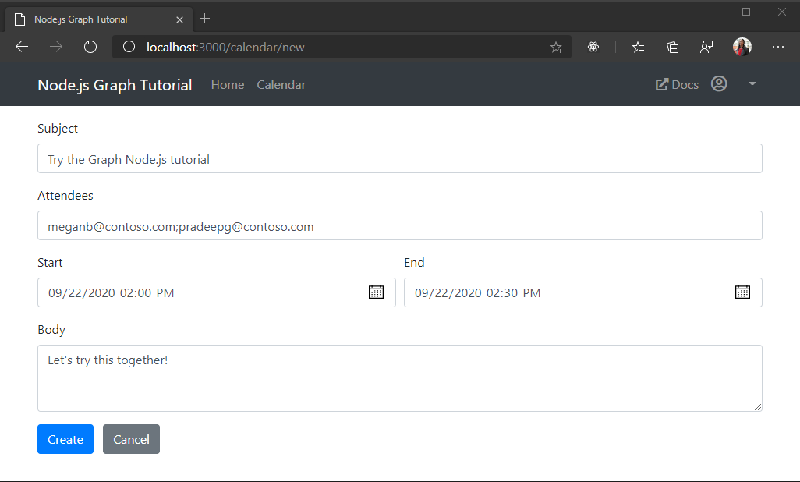

<!-- markdownlint-disable MD002 MD041 -->

En esta sección, agregará la capacidad de crear eventos en el calendario del usuario.

## Crear un nuevo formulario de eventos

1. Cree un archivo nuevo en el directorio **./views** denominado **newevent. HBS** y agregue el siguiente código.

    :::code language="html" source="../demo/graph-tutorial/views/newevent.hbs" id="NewEventFormSnippet":::

1. Agregue el siguiente código al archivo **./routes/calendar.js** antes de la `module.exports = router;` línea.

    :::code language="javascript" source="../demo/graph-tutorial/routes/calendar.js" id="GetEventFormSnippet":::

Esto implementa un formulario para la entrada del usuario y lo representa.

## Crear el evento

1. Abra **./graph.js** y agregue la siguiente función dentro de `module.exports` .

    :::code language="javascript" source="../demo/graph-tutorial/graph.js" id="CreateEventSnippet":::

    Este código usa los campos de formulario para crear un objeto de evento de Graph y, a continuación, envía una solicitud POST al `/me/events` extremo del para crear el evento en el calendario predeterminado del usuario.

1. Agregue el siguiente código al archivo **./routes/calendar.js** antes de la `module.exports = router;` línea.

    :::code language="javascript" source="../demo/graph-tutorial/routes/calendar.js" id="PostEventFormSnippet":::

    Este código valida y saneado la entrada de formulario y, a continuación, llama `graph.createEvent` a para crear el evento. Se redirige de nuevo a la vista de calendario cuando finaliza la llamada.

1. Guarde los cambios y reinicie la aplicación. Haga clic en el elemento **calendario** NAV y, a continuación, haga clic en el botón **crear evento** . Rellene los valores y haga clic en **crear**. La aplicación vuelve a la vista de calendario una vez que se crea el nuevo evento.

    
